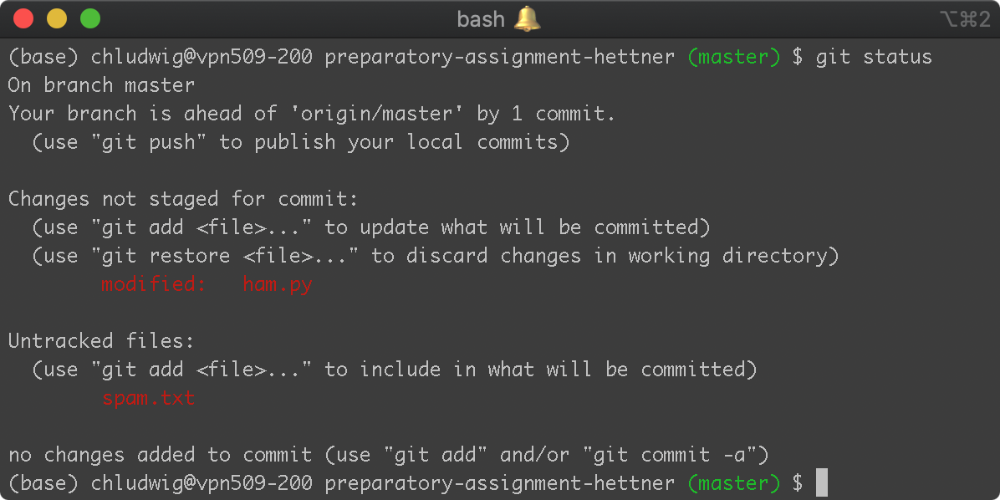
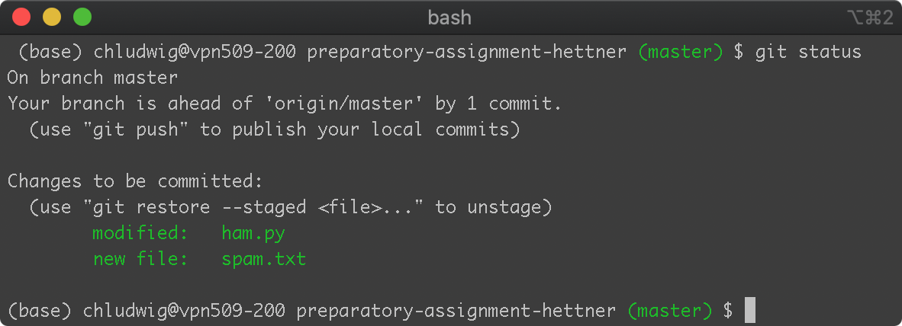
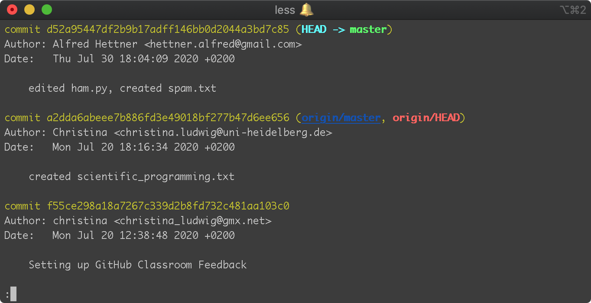

# Introduction to git

This is a short introduction to git. You may want to take a look at the **tutorial videos** for further instructions. Note that the videos are from last year, so there might be some differences (e.g. file names). 

### git is a Version Control System


* A Version Control System is a software that **tracks the file changes** of all contributors within a project.
* Originally developed to **assist collaborative open source software development** by Linus Torvalds (Initiator of Linux development)
* The **user chooses which files are tracked** and which file changes are recorded.
* All tracked files of a project are stored in a **git repository** ("repo").


### git tracks file changes through *commits*

Each line is a commit, a saved state of your project. Each commit has a creator, a time stamp and a message which describes what has been changed in the files of the project. 


### *git status* shows the current state of the repository

```
$ git status
```




### A *commit* records file changes within the *repository*

Adding files to the staging area, which will be included in the next commit.

```
$ git add ham.py
$ git add spam.txt
```




Creating the commit containing the files in the staging area:

```
$ git commit -m "edited ham.py, created spam.txt"
```

### git needs to know who is creating the commit

Registering your user name and email:

```
$ git config --global user.name "Alfred Hettner"
$ git config --global user.email "hettner.alfred@gmail.com"
```

*Note:* This has to be done only once. It does not have to be your GitHub user name or email.


### *git log* shows all commits of this repository

```
$ git log
```



*Note:* You can exit the log by typing "q", if you use the default command line editor *vim*.


### Synchronizing your local commits with a central git repository


### Connecting a local repository to a central repository

**Option 1:** Clone the repository to your computer:

```
$ git clone https://github.com/geoscripting/preparatory-assignment-hettner
```

**Option 2:** Create a local repository and connect it to a central repository:

```
$ git init
$ git remote add origin https://github.com/hettner/my_empty_repo.git
```

#### Resources

The Software Carpentry provides a good [git tutorial](http://swcarpentry.github.io/git-novice).
