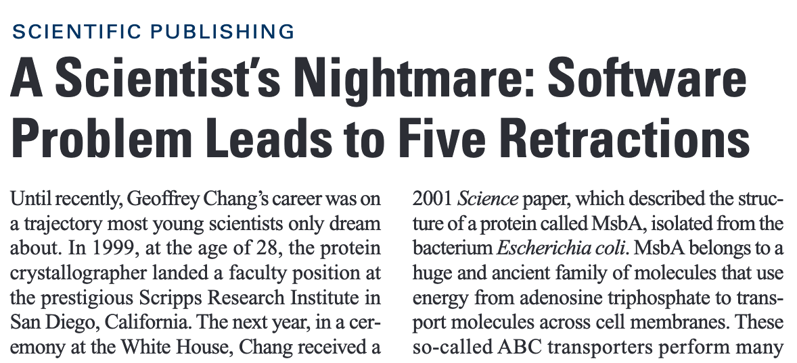

[comment]: # (Set the theme:)
[comment]: # (THEME = white)
[comment]: # (CODE_THEME = zenburn)
[comment]: # (The list of themes is at https://revealjs.com/themes/)
[comment]: # (The list of code themes is at https://highlightjs.org/)

[comment]: # (Pass optional settings to reveal.js:)
[comment]: # (controls: false)
[comment]: # (keyboard: true)
[comment]: # (markdown: { smartypants: true })
[comment]: # (hash: false)
[comment]: # (progress: true)

[comment]: # (respondToHashChanges: false)
[comment]: # (Other settings are documented at https://revealjs.com/config/)

### Advanced Geoscripting: 
### Pre-Meeting

Heidelberg University | Institute of Geography | June 9 2021

[comment]: # (!!!)

### Agenda

1. Course organization
2. Preparatory assignment 

[comment]: # (!!!)

### Course instructor

* Christina Ludwig
* PhD Candidate at GIScience Research Group (Prof. Zipf)
* Office: INF 348 / 12b

If you have questions, please contact me via email at [christina.ludwig@uni-heidelberg.de](mailto:christina.ludwig@uni-heidelberg.de).

[comment]: # (!!!)

### Why this course? 

[comment]: # (!!!)

#### Course content 

Best-Practices in Scientific Programming (Wilson et al., 2014)

Learning how to write ...

* readable (e.g. Geospatial data structures and object oriented programming
* reliable (e.g. unit testing)
* efficient (e.g. computer hardware, python packages for spatial analysis)
* maintainable 
* reusable 
* reproducible code. (e.g. documentation)

<!-- .element: style="font-size:20" -->

[comment]: # (!!!)

### Prerequisites - Courses

* Introduction to GIS
* Cartography
* GeoScripting

[comment]: # (!!!)

### Prerequisites : Knowledge / Skills

* Use the command line 
* Basics of Python
* Coordinate reference systems 

[comment]: # (!!!)

### Grading

1. Group work (during block course) 
2. Programming project + report (after block course)

Credits: 4 ECTS 

[comment]: # (!!!)

### Time schedule 

Course will be online on **MS Teams** 

Wed, July 28 - Thu, July 29 

Mon, Aug 2 - Wed, Aug 4

If necessary optional meeting before the block course for questions/problems with the preparatory assignment.

[comment]: # (!!!)

### Any questions? 

[comment]: # (!!!)

### References

Wilson G, Aruliah DA, Brown CT, Chue Hong NP, Davis M, Guy RT, et al. (2014) Best Practices for Scientific Computing. PLoS Biol 12(1): e1001745. https://doi.org/10.1371/journal.pbio.1001745

